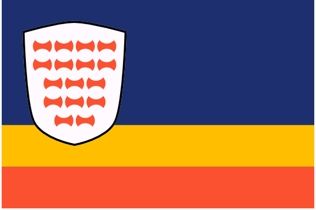
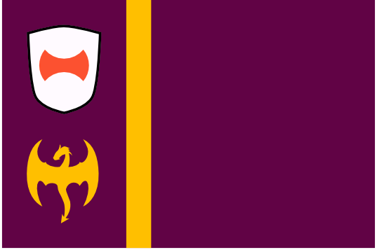

# Dracean Intercoastal Republic (DIR)
/dræʧeɪən ɪntəkəʊstᵊl rɪpʌblɪk/

{.torillic-no-splash}

Despite the name, the Dracean Intercoastal Republic (DIR) is neither dracean, intercoastal or a republic. After the collapse of the Dracean Empire, their territories to the north fractured into smaller kingdoms. Over time however, the shared cultural values from their time as Dracean states drew them together into a loose confederacy. While each individual state is feudal, governed by a monarch with hereditary lords beneath them, these states together elect a "Chancellor" to represent the region as a collective. The current chancellor is [Wilhelm van Noord](../people/wilhelm_van_noord).

## Geography
The DIR is made up of 16 full member states, plus the associate member states of Zarovia, Drace, and the various Kaiprite trading colonies lining the east coast.

### Dracea Major
In the days of the Dracean Empire, the earliest regions to be conquered by the expanding city state (and the most stable across the Empire's history, up until its final decline) retain their imperial borders. The modern states take the names of the regions they occupy, and are the most strongly influenced by Dracean culture among the states of the DIR.

#### Paltaea
{.torillic-no-splash}
The original Dracea Major, forming a C shape around the historic city of Drace, Paltaea was the very last imperial holding to fall. As the only nation with a land border to Drace, Paltaea has grown vastly wealthy off of its monopoly on trade between the historic city and the rest of the DIR.

#### Quirilto
{.torillic-no-splash}

#### Viminus
{.torillic-no-splash}

#### Esquilo
{.torillic-no-splash}

#### Caellia
{.torillic-no-splash}

#### Aven
{.torillic-no-splash}

#### Servia
{.torillic-no-splash}

Though not a part of historic Dracea Major, the region of Servia has been dominated by Drace as long as any of its contemporaries. The difference is that it spend several millenia as a slave state, treated by Drace not as a legitmate region of the empire but simply as a supply of people and resources to be plundered at will. Even once the borders of the Dracean Empire extended far beyond Dracea Major in every direction, Servia remained something of a ghetto and was never granted the full member status of its contemporaries under the Empire. The violent uprising and subsequent independence of the Servs struck a crucial blow to the aisling Dracean Empire and was one of the key catalysts in its eventual demise.

### Noord
The northern regions, bordering Uttmark. Before the old Dracean territories formed the DIR, these regions were a single nation and a chief antagonist to Drace in its latter years: Noordland.

#### Nautr
{.torillic-no-splash}

Mountainous, rocky, isolated from their DIR allies to the east and sharing a coast with the Uttgardt to the north, Nautr is one of the hardest territories for the DIR keep and acts as a frequent point of conflict between DIR forces and the raids from the Red Tiger tribe.

#### Barba
{.torillic-no-splash}

Once a buffer between the early Dracean Empire and the barbarians of the north, Barba has trade relationships to their north and south which date back millennia. Despite other DIR states being closer to the border, Barba are the first point of contact when Uttgardt from the less hostile tribes trade firs and metalworking with the DIR.

#### Beflund
{.torillic-no-splash}

Home state of current chancellor [Wilhelm van Noord](people/wilhelm_van_noord), Beflund is a fertile region in the heart of the DIR.

#### Uttlund
{.torillic-no-splash}

Containing the most northerly point in the DIR, Uttlund is an interesting blend of Uthgardt and Noord culture, with citizens practicing some Uthgardt traditions alongside proto-Uthgardt theistic practices and more modern reformed practices like the rest of Noord.

#### Snorlund
{.torillic-no-splash}

The largest of the Noord states, Snorlund shares a border with Uttmark and is considered the quintessential Noord state. 

### Other

#### Pyrria
{.torillic-no-splash}

Controls the mountain pass to the coastal Kyprite colonies to their east, deals heavily in copper.

#### Parbatia
{.torillic-no-splash}

Once an independent Tabaxi colony, Parbatia joined the DIR fairly recently and acts as something of a buffer between the DIR and the comparatively isolationist Tabaxi to the southwest.

#### West Scutia
{.torillic-no-splash}

Once a military stronghold guarding the Dracean Empire from the Atkani via a mountain pass in the connecting mountain range, West Scutia remains a militaristic border city under the DIR. 

#### East Scutia
{.torillic-no-splash}

Like their western counterparts, East Scutia lies on the border with the Atkani steppe. However, with fewer passages through the mountains, East Scutia is much less heavily defended.

