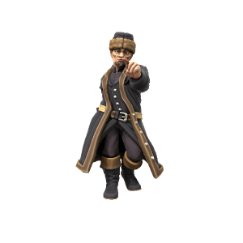

# Wilhelm van Noord
/wɪlhɛlm væn nɔd/

> **Pronouns** he/him
> **Species** [Human](/lore/species/human)
> **Age** 32
> **Affiliations** [Dracean Intercoastal Republic](/places/dracean_intercoastal_republic)]

#### Ideals
Chancellor Wilhelm is an ambitious man. Coming from nothing to hold the highest office in the DIR, his cunning and political wile is formidable. It's no secret that Wilhelm wishes to bring the whole of the Uthgardt lands under DIR control, though what exactly he sees in the largely frozen and unprofitable lands to the north is a mystery to his contemporaries.

#### Bonds
While popular among the monarchs within the DIR, he is a contentious figure further north, he is despised by the [Uthgardt](/lore/species/human#uthgardt-humans) as a coloniser and a threat to their way of life, owing to several agressive border skirmishes. 

#### Flaws
Wilhelm is cold and calculating, he sees people more as pieces in a game than anyone he has an obligation to.

---

