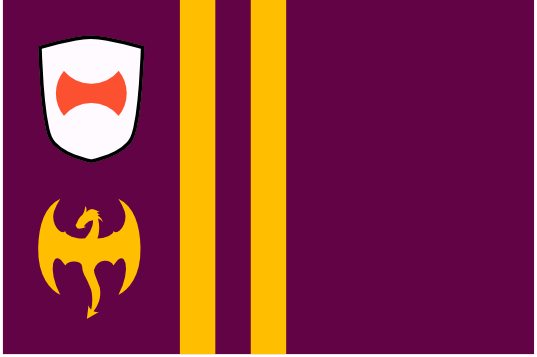
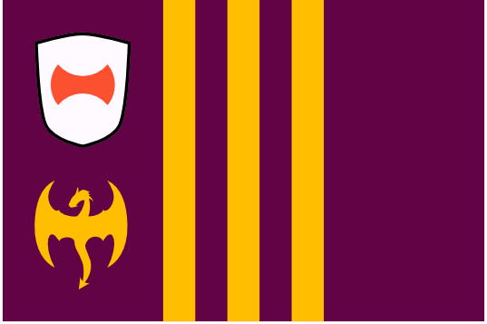

# Dracea Major
In the days of the Dracean Empire, the earliest regions to be conquered by the expanding city state (and the most stable across the Empire's history, up until its final decline) retain their imperial borders. The modern states take the names of the regions they occupy, and are the most strongly influenced by Dracean culture among the states of the DIR.

#### Paltaea
{.torillic-no-splash}
The original Dracea Major, forming a C shape around the historic city of Drace, Paltaea was the very last imperial holding to fall. As the only nation with a land border to Drace, Paltaea has grown vastly wealthy off of its monopoly on trade between the historic city and the rest of the DIR.

#### Quirilto
{.torillic-no-splash}

#### Viminus
{.torillic-no-splash}

#### Esquilo
{.torillic-no-splash}

#### Caellia
{.torillic-no-splash}

#### Aven
{.torillic-no-splash}

#### Servia
{.torillic-no-splash}

Though not a part of historic Dracea Major, the region of Servia has been dominated by Drace as long as any of its contemporaries. The difference is that it spend several millenia as a slave state, treated by Drace not as a legitmate region of the empire but simply as a supply of people and resources to be plundered at will. Even once the borders of the Dracean Empire extended far beyond Dracea Major in every direction, Servia remained something of a ghetto and was never granted the full member status of its contemporaries under the Empire. The violent uprising and subsequent independence of the Servs struck a crucial blow to the aisling Dracean Empire and was one of the key catalysts in its eventual demise.