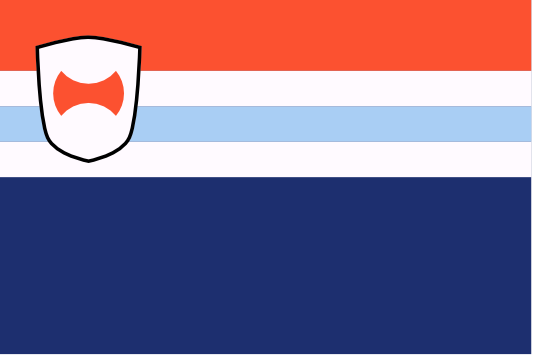

# Noord

The northern regions, bordering Uttmark. Before the old Dracean territories formed the DIR, these regions were a single nation and a chief antagonist to Drace in its latter years: Noordland.

#### Nautr
{.torillic-no-splash}

Mountainous, rocky, isolated from their DIR allies to the east and sharing a coast with the Uttgardt to the north, Nautr is one of the hardest territories for the DIR keep and acts as a frequent point of conflict between DIR forces and the raids from the Red Tiger tribe.

#### Barba
{.torillic-no-splash}

Once a buffer between the early Dracean Empire and the barbarians of the north, Barba has trade relationships to their north and south which date back millennia. Despite other DIR states being closer to the border, Barba are the first point of contact when Uttgardt from the less hostile tribes trade firs and metalworking with the DIR.

#### Beflund
{.torillic-no-splash}

Home state of current chancellor [Wilhelm van Noord](people/wilhelm_van_noord), Beflund is a fertile region in the heart of the DIR.

#### Uttlund
{.torillic-no-splash}

Containing the most northerly point in the DIR, Uttlund is an interesting blend of Uthgardt and Noord culture, with citizens practicing some Uthgardt traditions alongside proto-Uthgardt theistic practices and more modern reformed practices like the rest of Noord.

#### Snorlund
{.torillic-no-splash}

The largest of the Noord states, Snorlund shares a border with Uttmark and is considered the quintessential Noord state. 