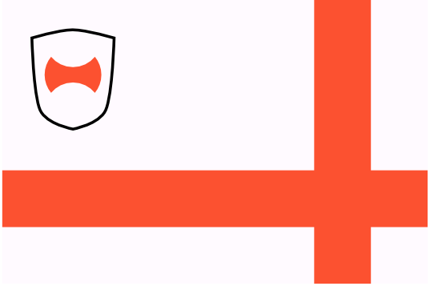
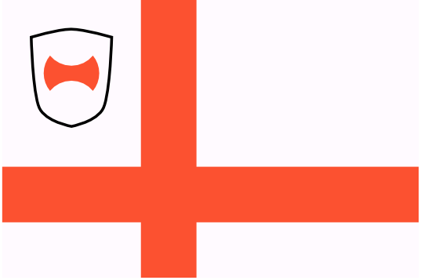

# Scutia

The border states between the [DIR](/places/dracean_intercoastal_republic) and the [Atkani Steppe](/places/ordo_atkan) were once a single polity, but after being folded into the Dracean empire and split into three provinces, they never reuinified. East and West Sutia are now members of the DIR, Central Scutia was a member at one point but broke from the republic when [Prince Strahd Drakul](/places/zarovia/people/strahd_drakul) rose to power and renamed the now-independent princedom to [Zarovia](/places/zarovia). As Strahd's fearsome reputation makes him an effective buffer with the Atkani, Zarovia has a surprisingly warm relationship with the DIR.

Though separated by Zarovia, the two Scutias still share a great deal of culture. Both share similar cuisines (heavily spiced with paprika and making liberal use of pickled vegetables; Scutian pickles are world renowned), similar fashion and speak the same language with only minor accent differences.

#### West Scutia
{.torillic-no-splash}

Once a military stronghold guarding the Dracean Empire from the Atkani via a mountain pass in the connecting mountain range, West Scutia remains a militaristic border city under the DIR. The most notable landmark is a colossal wall spanning the valley between two mountain ranges, the only entry point through the east Parbat mountains. This wall is so tall that sunset appears to happen up to two hours earlier in the capital city than in the rest of the province, due to the shadow cast by the wall.

#### East Scutia
{.torillic-no-splash}

Like their western counterparts, East Scutia lies on the border with the Atkani steppe. However, with smaller passages through the mountains, East Scutia is much less heavily defended. It serves as the key port for trade with [T'Savo](/places/tsavo).