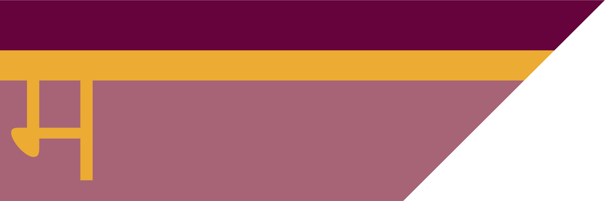

# Kashar
/kæʃɑ/

{.torillic-no-splash}

The Kashar Sultanate is a major power in the southern continent, ruling over a vast area rich in spices, precious metals and fine silks. The ruling family of Kashar are the Kash dynasty, an elven family whose rule dates back to the nation's foundation.

### Religion

The state religion of Kashar is [Sikari](/religions/sikari), but Kasharites also worship a variety of personal deities. The [Kobolds](/organisations/kobolds) have a strong presence all across Kashar, but especially in Dhurga-Agun. Most well-off households keep a small shrine to a patron deity, usually a [fey rhea](/cosmology/fey/fey_rhea) who acts as a household guardian. There are also small, local instutions dedicated to particular [daemons](/cosmology/daemons) and embodying their aspects.

### Economy

Kashar is one of the major world producers of food, owing to the predictable flood patterns of the river Jibana, making [Jami-Urbara](/places/kashar/geography#jami-urbara). Though blocked from establishing trade routes to the east by [Atkani](places/ordo_atkan) raiding parties, Kashar exports tremendous amounts of food by sea through its ports in [Jami-Sonna](/places/kashar/geography#jami-sonna)

### Geography

Kashar is built around the mouth of the river Jibana, sandwiched between the Parbat mountain range marking the southern border of a great desert, and the Satru mountains marking the western borders of [Ordo'Atkan](/places/ordo_atkan).

The lands are split into five regions, known as Jami, each with its own regional government:

#### Jami-Urbara

{.torillic-no-splash}

The main source of food in the region; shallow capillary rivers split the land in this region, flooding and receding in an extremely consistent pattern which the locals have learned to utilise to grow vast quantities of high quality crops.

#### Jami-Sonna

{.torillic-no-splash}

The trade hub of Kashar, Jami-Sonna has a very navigable western coast with a defensible delta at the river's bifurcated mouth. Jami-Sonna is absolutely essential to the Sultanate's maritime trade network.

#### Jami-Satru

{.torillic-no-splash}

The first region colonised by [elves](/species/sapient/elf) during the nameless wars, Jami Satru covers the southeast border of the Sultanate and is a stronghold for royalists. Citizens of Jami-Satru man the outposts in the Satru mountain range, where their ancestors once crossed into the then-loxodon controlled region.

#### Jami-Parbat

{.torillic-no-splash}

This isolated mountainous region is the ancestral homeland of Kashar's [tabaxi](/species/sapient/tabaxi) population. While its rocky slopes are near impossible to farm, it is excellent hunting ground and many of the Sultan's luxurious furs are sourced from this region.

#### Jami-Marub

{.torillic-no-splash}

While the whole of Kashar was populated by [loxodon](/species/sapient/loxodon) when the elves arrived, Jami-Marub is believed to be the first land of the loxodon people, and holds great cultural and religious significance for them. Situated around a break in the Parbat mountains, this region is often called the "gateway to the desert" and is by far the most hospitable point of access to the desert from the south.

#### Dhurga-Agun

{.torillic-no-splash}

The capital city of Kashar, Dhurga-Agun, functions as an autonomous region independent from the five Jami, governed directly by the Visir.

