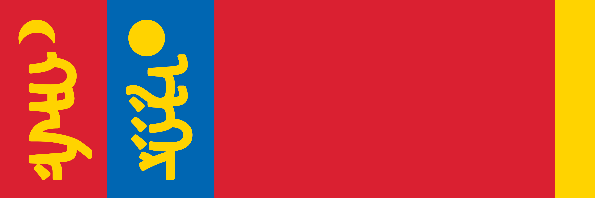
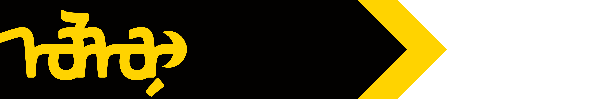
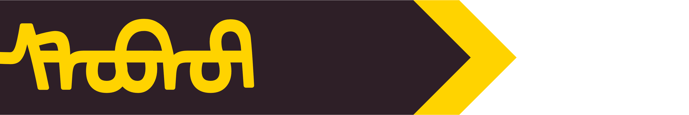

# Ordo'Atkan
/ɔdəʊ ætkɑn/

East of [Kashar](/places/kashar) lies a land of wide open planes where the nomadic Atkani people roam. The Atkani are primarily and historically Orcish, but the horde considers anyone who lives by the "Way Of The Open Sky" to be equally of their people, regardless of species. Ordo'Atkan is a Khanate, ruled by an absolute leader whose position is enforced based on their personal strength and prowess in battle. The current khan is [Olon Sum](people/olon_sum).

### The Way Of The Open Sky
The atkani worship [Ouron](/cosmology/fey/fey_eilea/ouron), known to them as Ouron Teng, as the fey from whom the sky is manifest. Living in wide open plains with a dry climate, the vastness of the sky above is of great cultural importance to the atkani.

### Hordes

Atkani are organised into hordes, swearing fealty to a Khan and following their caravan, constantly rotating across the entire steppe as their horses graze. While no horde controls any particular territory, the stronger hordes are able to secure pastures at their best time of year. Some of the major hordes are listed below.

#### Ordo'Olon

Sometimes, a single leader will unite the hordes under their rule, becoming the Great Khan. While lesser Khans retain their horde and pasture claims, they agree to follow the Great Khan when called to war. At present, [Olon Sum Khan](people/olon_sum) is the Great Khan, so his personal horde is the largest and most feared in the steppe.

#### Ordo'Subut

Horde of Subut Khan, a cunning tactician known for winning unlikely victories through a mixture of ingenious tactics and psychological brutality. While the horde of the Great Khan is the mightiest force in the steppe, the approach of Ordo'Subut is a sight most travellers fear most.

#### Ordo'Kyodug

While hordes are won through prowess in battle and the respect of one's followers, being the Great-Grandson of Great Khan Xaldug certainly helps. Kyodug Khan would never acknowledge this, of course, and would likely kill anyone who implied as such. He is Khan in his own right, by the way of the open sky. **Tengur aldar**.

