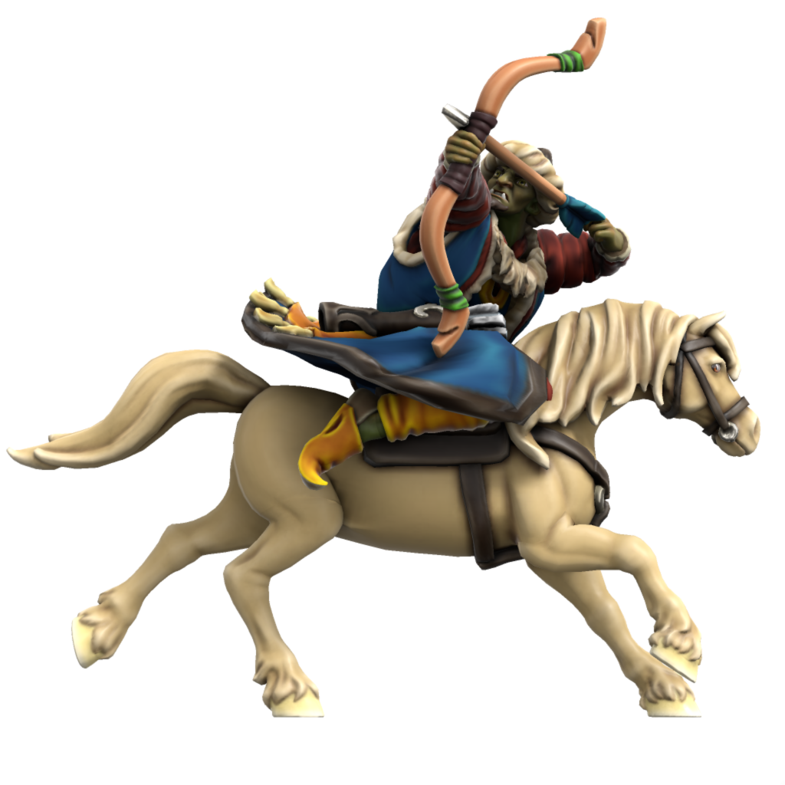

# Military
All Atkani are expected to be proficient in both horseriding and archery, a tradition called the "Way Of The Open Sky", meaning any given civillian can serve as a Keshik, a mounted horse archer warrior. When united, the Atkani Horde is near unstoppable, but the nomadic lifestyle of the Atkani people places a logistical restraint on sustained campaigns. The Horde prefer instead to hit hard and fast, decimating the enemy and exacting tribute before returning to their homelands.

### Keshik
Mounted archers, the key unit of the Ordo'Atkan horde. The shortbow sacrifices range for accuracy and speed, these units hit fast and hard, deadly at mid range.



```statblock:5e
### Warhorse

---

**Armor Class** 11
**Hit Points** 19 (3d10 + 3)
**Speed** 60 ft.

---

| STR  | CON  | DEX  | INT  | WIS  | CHR  |
| ---- | ---- | ---- | ---- | ---- | ---- |
| +4   | +1   | +1   | -4   | +1   | -2   |
| 18   | 13   | 12   | 2    | 12   | 7    |

---

🐎 **Hooves**. *Melee Weapon Attack:* +6 to hit, reach 5 ft., one target. *Hit:* 11 (2d6 + 4) bludgeoning damage.

```


```statblock:5e
### Keshik

---

**Armor Class** 11 (Hide Coat, Hat)
**Hit Points** 32 (5d8 + 10)
**Speed** 30 ft., 🐎 60ft.
**Proficiency Bonus** +2

---

| STR  | CON  | DEX  | INT  | WIS  | CHR  |
| ---- | ---- | ---- | ---- | ---- | ---- |
| +2   | +1   | +1   | +0   | +0   | +0   |
| 14   | 13   | 12   | 10   | 11   | 10   |

---

***Pack Tactics.*** The keshik has advantage on attack rolls against a creature if at least one of its allies is within 5 feet of the creature and the ally isn't incapacitated.

🐎 ***Encircle.*** One or more keshik uses their movement to continuously rides in a circle (radius 20ft. + 5ft. for each keshik circling) around a target. Circling keshik take their action together by attacking with the **recurve bow**, but rather than rolling to hit, each keshik rolls 1d4 for cardinal direction (clockwise with 1 as north) and all entities inside the circle who aren't behind cover are hit.

---

🐎 ***Hooves**. Melee Weapon Attack:* +6 to hit, reach 5 ft., one target. *Hit:* 11 (2d6 + 4) bludgeoning damage.

***Multiattack***. The keshik makes two attacks with its recurve bow.

***Recurve bow.** Ranged Weapon Attack*: +4 to hit, range 80/320 ft., one target. Hit: 9 (1d8 + 4) piercing damage. The keshik carries a quiver with 25 arrows.

```