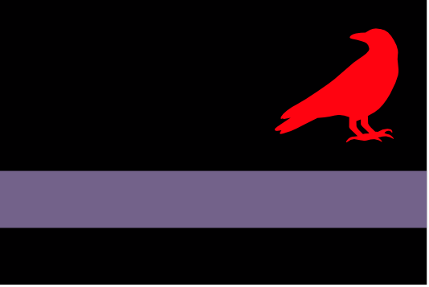

# Zarovia
/zɑrəʊviə/

Zarovia is a nominally independent Princedom to the south of the [Dracean Intercoastal Republic](/places/dracean_intercoastal_republic). It was once a member state, Central Scutia, but broke away when its ruler [Strahd Drakul](/places/zarovia/people/strahd_drakul.md) began gaining mysterious powers. The DIR largely respects Zarovia's independence and stays out of its affairs, mostly relieved to have a buffer at their most open border with [Ordo'Atkan](/places/ordo_atkan) as Prince Strahd's bloody reputation makes him one of the few figures whom the Atkani fear.