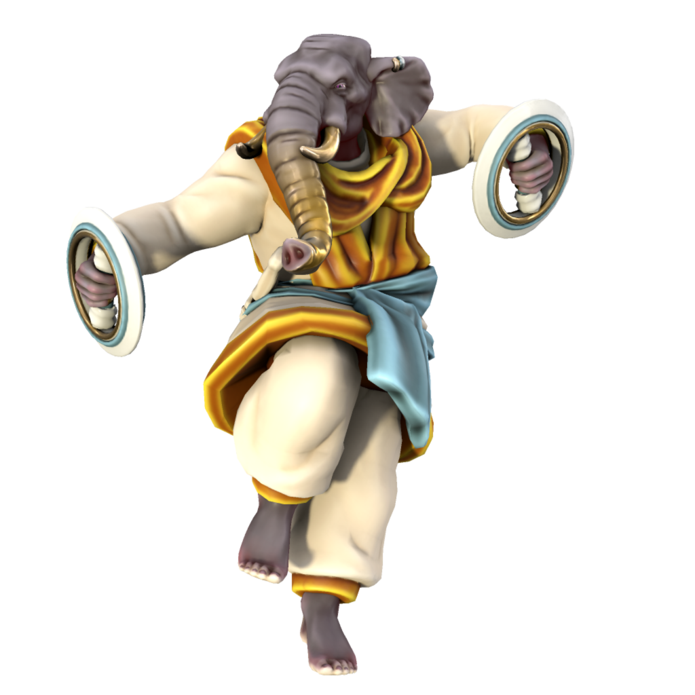

# Sikari

The state religion of Kashar, Sikari, is deeply rooted in the local history of the region. Followers revere the Eternal Flame, a magical fire housed in Durga-Agun atop a vast tower, burning in a vast metal dish full of oil. The flame has been burning since the founding of Kashar by the first Sultan and represents the strength and stability of the Kash dynasty. The fire is near impossible to extinguish, once lit any fuel will burn to ashes regardless of any attempt to put the fire out.

### Ranks

#### Brahman



The leader of the faith, advises the Sultan on spiritual matters and administers the Sikari faith.

#### Herbad


Herbadi are keepers of the flame, who generally perform the day to day maintenance such as adding oil and tower maintenance.

#### Mobad


Mobadi are trainee keepers of the flame, learning the ancient rituals from Herbadi.

### Theological debate

Sikarists disagree on the origin of the Eternal Flame. The official position of the Sultanate is that it was lit by the first Sultan, who was an accomplished sorceror. Many however, especially in Jami'Marub, believe it is the last remnant of the flame which destroyed [Nasruk](/stories/fall_of_nasruk). This disagreement is tolerated, but is a source of some political tension between the state and religious capitals.

```spoiler
The latter group are correct. While lost in the Parbat mountains, the first Sultan came to the border of [Nascut Deia](/places/nascut) and, through his skill as a sorceror, was able to extract a small section of root and keep it burning. When the first Kasharites came upon the land that is now Kashar, he transferred the flame first to a simple hearth, then constructed the tower where it now resides during his time as Sultan.
```