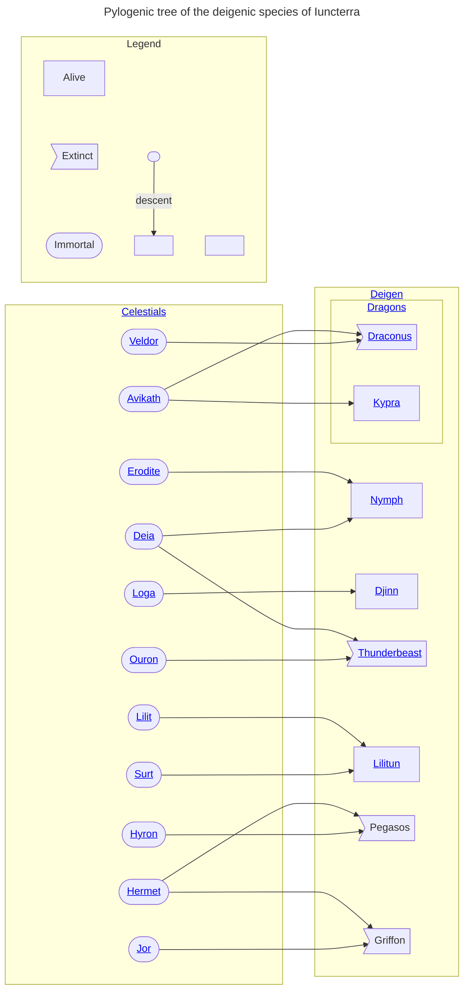

# Deigenic species

Deigen are creatures born from the union of two celestials within the material world. They cannot produce offspring themselves, but can breed with [sapient species](/species/sapient).

