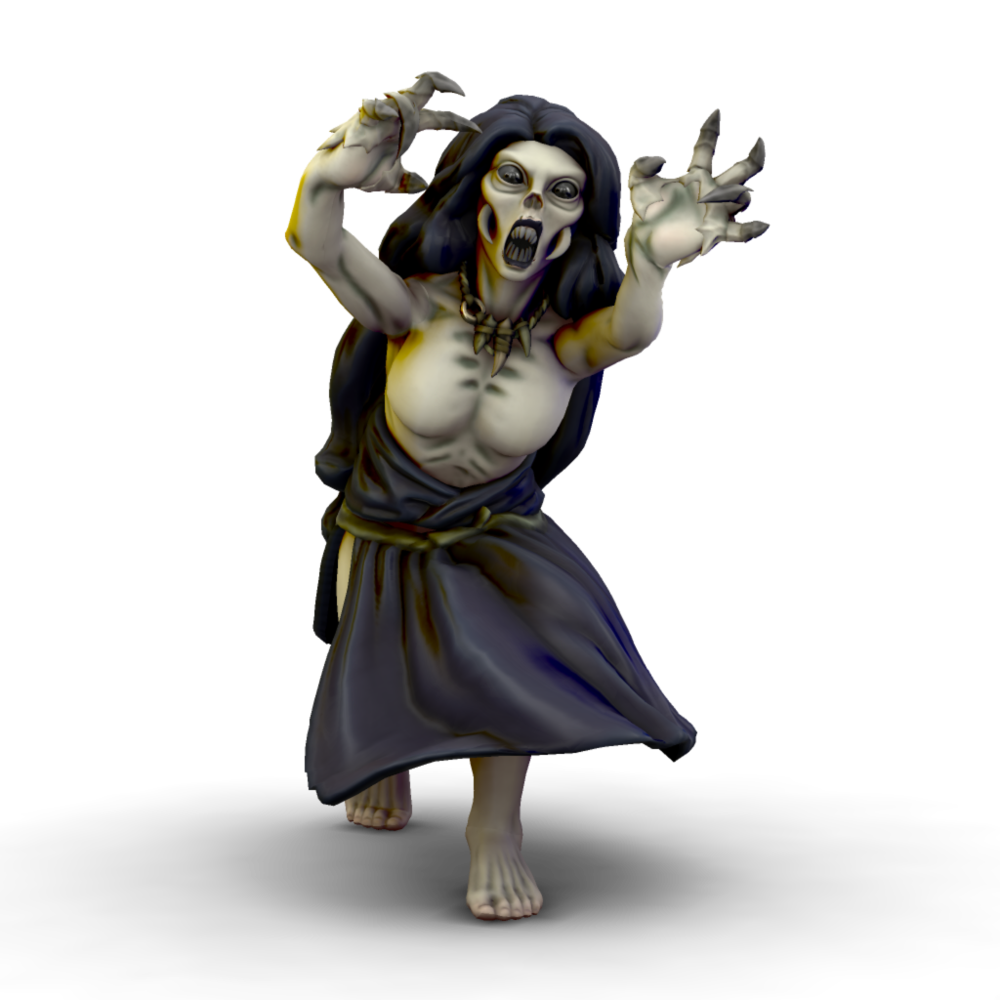

# Lilitun
/lɪlɪtun/



Lilitun are creatures of vengeance and destruction. They are drawn to intense feelings of wrath, often summoned by victims of violence and injustice. Once a lilitun has been drawn to an area, they will usually hunt down the target of the wroth which attracted them, but will rarely stop once they are dead. Many a settlement of innocent villagers has been wiped out because of one person's actions attracting a lilitun.

#### Physiology
Much like their daemonic mother, lilitun take on the form of a haggared woman in rags. They have pale, cracking skin and burned out eyes. They can run inhumanly fast, lurching after their victims on all fours. Their fingers are disproportionately long, with sharp claws perfect for latching on to a victim. Their mouths are full of sharp teeth which can strip flesh from bone with ease.

```statblock:5e
### Lilitun

---

**Armor Class** 11 (rags)
**Hit Points** 72 (16d8)
**Speed** 30 ft.
**Proficiency Bonus** +3

---

| STR  | CON  | DEX  | INT  | WIS  | CHR  |
| ---- | ---- | ---- | ---- | ---- | ---- |
| +4   | +4   | +2   | +1   | +3   | +4   |
| 18   | 18   | 14   | 13   | 16   | 18   |

---

**Damage Resistances** Necrotic, Psychic
**Damage Immunities** Poison
**Condition Immunities** Charmed, Exhaustion, Frightened, Paralyzed, Poisoned, Stunned
**Senses** Darkvision 60 ft., Passive Perception 13

---

***Regeneration.*** The lilitun regains 10 hit points at the start of its turn. If the lilitun takes fire or radiant damage, this trait doesn’t function at the start of the its next turn. The lilitun’s body is destroyed only if it starts its turn with 0 hit points and doesn’t regenerate.

***Rejuvenation.*** When the lilitun’s body is destroyed, its soul lingers. After 24 hours, the soul inhabits and animates another humanoid corpse on the same plane of existence and regains all its hit points. While the soul is bodiless, a wish spell can be used to force the soul to go to the afterlife and not return.

***Turn Immunity.*** The lilitun is immune to effects that turn undead.

***Vengeful Tracker.*** The lilitun knows the distance to and direction of any creature against which it seeks revenge, even if the creature and the lilitun are on different planes of existence. If the creature being tracked by the lilitun dies, the lilitun knows.

---

***Multiattack.*** The lilitun makes two fist attacks.

***Claws.** Melee Weapon Attack*: +7 to hit, reach 5 ft., one target. *Hit*: 2d6 + 4 slashing damage. If the target is a creature against which the lilitun has sworn vengeance, the target takes an extra 4d6 bludgeoning damage. Instead of dealing damage, the lilitun can grapple the target (escape DC 14) provided the target is Large or smaller.

***Vengeful Glare.*** The lilitun targets one creature it can see within 30 feet of it and against which it has sworn vengeance. The target must make a DC 15 Wisdom saving throw. On a failure, the target is paralyzed until the lilitun deals damage to it, or until the end of the lilitun’s next turn. When the paralysis ends, the target is frightened of the lilitun for 1 minute. The frightened target can repeat the saving throw at the end of each of its turns, with disadvantage if it can see the lilitun, ending the frightened condition on itself on a success.
```