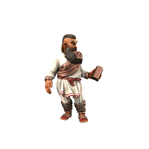

# Dwarf

Dwarves originate from the copper-rich island of [Kaiper](/places/kaiper), having evolved in isolation under the benevolent eye of the copper dragon [Kypra](/species/deigen/dragons/kypra). They are small in stature, but thick muscled and very strong. In [4700AD](/timeline#4700AD), the first Kaiprite ships touched down on the eastern coast of Iuncterra proper.

### Cultures

#### Kaiprite Dwarves
/kaɪpraɪt/

> **Languages** [Kypritic](/languages/kypritic), [Common](/languages/common)
> **Accent** [🗣️](https://www.dialectsarchive.com/cyprus-1)

Dwarves from their island homeland are an energetic lot who, having been separate from Iuncterra proper until only a few centuries ago, follow customs and practices which seem strange to mainlanders. They worship Kypra and will pray to her for guidance and protection even when far away from home. 

#### Mainland Dwarves

> **Languages** [Common](/languages/common), [Kypritic](/languages/kypritic)
> **Accent** [🗣️](https://www.dialectsarchive.com/greece-1)

Mainland dwarves, descendants of those who first sailed from Kaiper and settled in Iuncterra proper, are still recognisably culturally Kaiprite, but over the past few centuries have taken on some mainland customs. Most, for example, no longer worship Kypra - instead venerating mainland deities or joining the Kobalds.

#### Veldspine Dwarves
/vɛldspaɪn/

> **Languages** [Uttic](/languages/uttic), [Common](/languages/common), [Kypritic](/languages/kypritic)
> **Accent** [🗣️](https://www.dialectsarchive.com/russia-3)

Characterised by comparatively light skin and a more grim demeanour, the dwarves of the Veldspine mountains differ greatly from their more southerly kin. Having left the coastal mercantile settlements in search of riches in the cold North mountains, their isolated lifestyle make them a somewhat dour and serious folk.

### Ageing
|/species/sapient/aging.xlsx:Dwarf|

