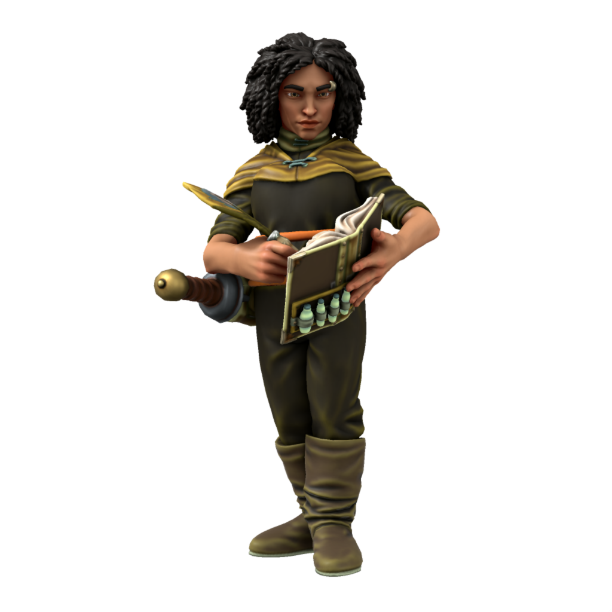
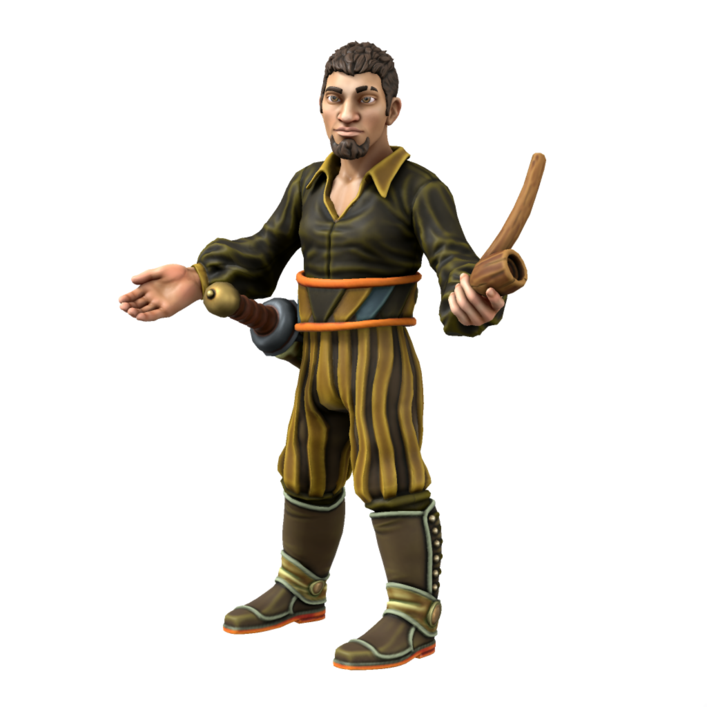
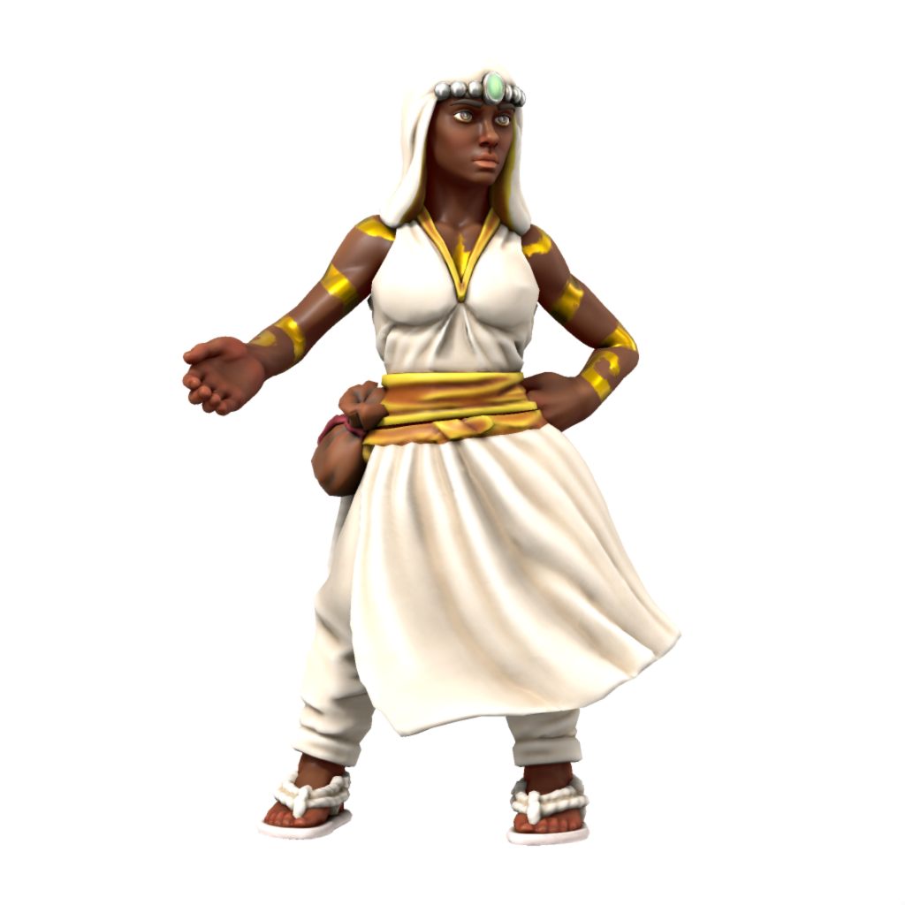

# Human

The most diverse and widespread of sapient peoples, humans can be found most everywhere. They are recognisable by their rounded ears.

### Cultures

#### Dracean Humans

> **Languages** [Low Dracean](/languages/dracean#low-dracean), [Common](/languages/common)
> **Accent** [🗣️](https://www.dialectsarchive.com/italy-13)

Humans of the core Dracean regions still keep to a largely Dracean lifestyle; speaking low dracean, celebrating dracean holidays, eating dracean food. Dracean humans see themselves as the rightful inheritors of the Dracean legacy, with something of a cultural superiority complex over the rest of the DIR. They're also *extremely* passionate about food, it is often remarked that [Olon Sum Khan](/places/ordo_atkan/people/olon_sum) himself wouldn't dare to insult a Dracean nana's cooking.

#### Scutian Humans

> **Languages** [Scutian](/languages/parbati#scutian), [Common](/languages/common)
> **Accent** [🗣️](https://www.dialectsarchive.com/macedonia-1)

The border states between the DIR and Atkani steppe are historically defined by conflict. Scutians are generally hostile towards orc, having long been subject to Atkani raids. A particularly important part of Scutian culture is that all citizens of age carry a gladius when outside of their home, so as to protect against invaders. Even when far from the border, Scutians hold fiercely to this tradition and are never seen outside without their sword.

#### Servian Humans

> **Languages** [Servian](/languages/servian), [Common](/languages/common), [Low Dracean](/languages/dracean#low-dracean)
> **Accent** [🗣️](https://www.dialectsarchive.com/romania-1)

In the days of the Dracean Empire, Servia was treated as little more than a source of resources and labour, with Servian humans most often serving the Empire as slaves rather than the full citizenship enjoyed by the other imperial regions. After the fall of the Dracean Empire, Servians took up the Scutian tradition of all citizens being armed - the ethos being that if any Servian (or later, DIR) leader rises to the levels of despotism of the late emperors, then there is an armed populus ready to rise up.

#### Noordic Humans

> **Languages** [Noordic](/languages/noordic), [Common](/languages/common)
> **Accent** [🗣️](https://www.dialectsarchive.com/germany-1)

These light skinned speakers of an Unthic language are seen by other humans as "civilised" Uthgardt, but see themselves as wholly separate from their northern cousins. Noords are a very modern people, keen to push forward social change and embrace modernity.

#### Uthgardt Humans

> **Languages** [Uttic](/languages/uttic), [Common](/languages/common), [Noordic](/languages/noordic) (eastern tribes only)
> **Accent** [🗣️](https://www.dialectsarchive.com/iceland-2)

The humans of the cold north are a hardy and warlike bunch, worshipping the deified ancient warrior [Uthgar](/cosmology/daemons/apotheotes/uthgar) and placing great significance of raiding as a way of life. While not averse to trade, Uthgardt will not trade for goods when they see the other party as weak. In their eyes, why trade for something which you could by rights simply take?

#### Kasharite Humans

> **Languages** [Low Kushite](/languages/kushite#low-kushite), [Common](/languages/common), [High Kushite](/languages/kushite#high-kushite) (elites only)
> **Accent** [🗣️](https://www.dialectsarchive.com/saudi-arabia-1)

Humans have been a crucial part of Kashar since its foundation, as many of the initial Savonic colonies came with allied Dracean colonists aboard. While theoretically a lower caste than elves, humans are not limited in the offices they can fill (as Loxodon and Tabaxi are) and in day to day life are as proud as Kasharite elves.

### Ageing
|/species/sapient/aging.xlsx:Human|