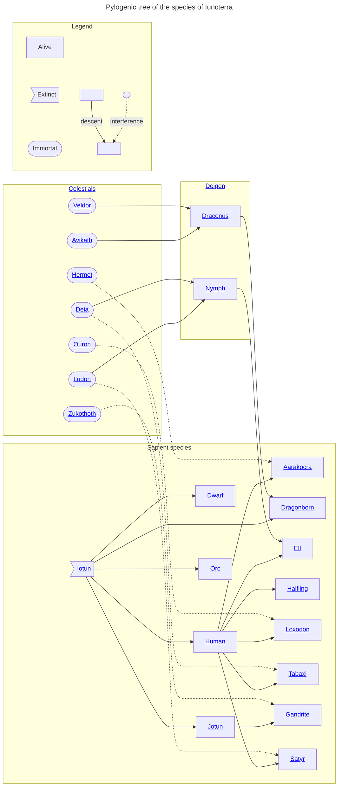

# Sapient species

Iuncterra is home to a wide variety of sapient creatures, the graph below shows the phylogenic relationships between them.

#### Ageing
Different species age at different rates. Taking the rate of ageing in humans as a baseline, equivalent ages of other species can be calculated by the following multipliers:

|/species/sapient/aging.xlsx:Multipliers|

When parents of two different species have a child, the results can vary when it comes to ageing. Generally a child of a long lived species with a shorter lived species will gain only a slight increase to their lifespan, particular when elven genes are concerned. The genes for short lifespans are generally dominant.