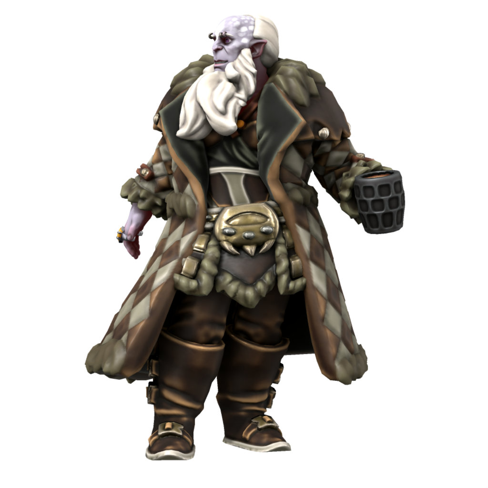
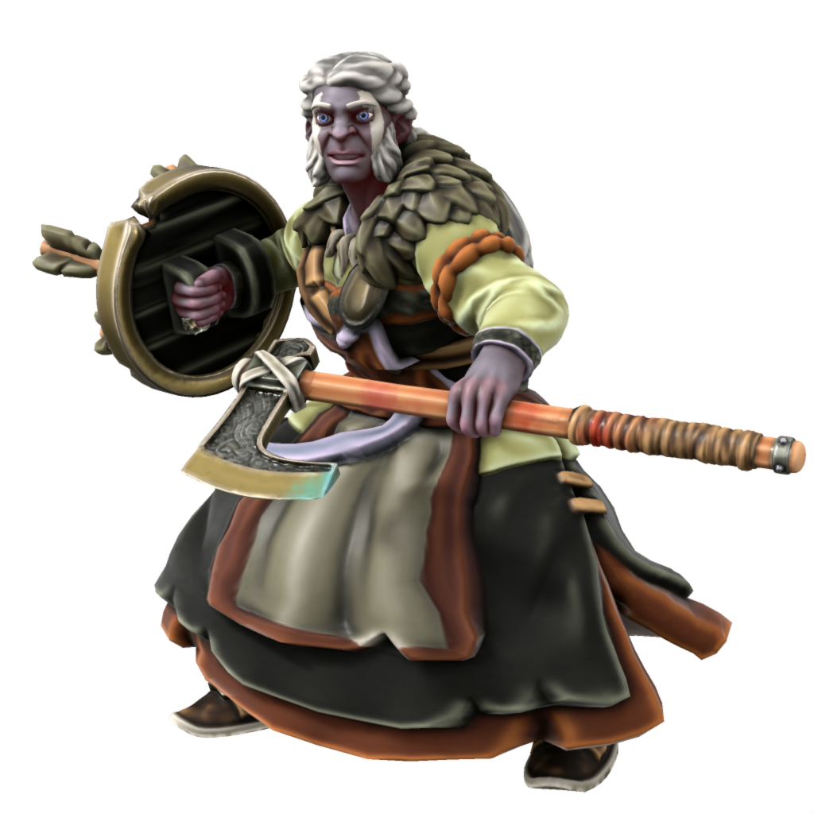
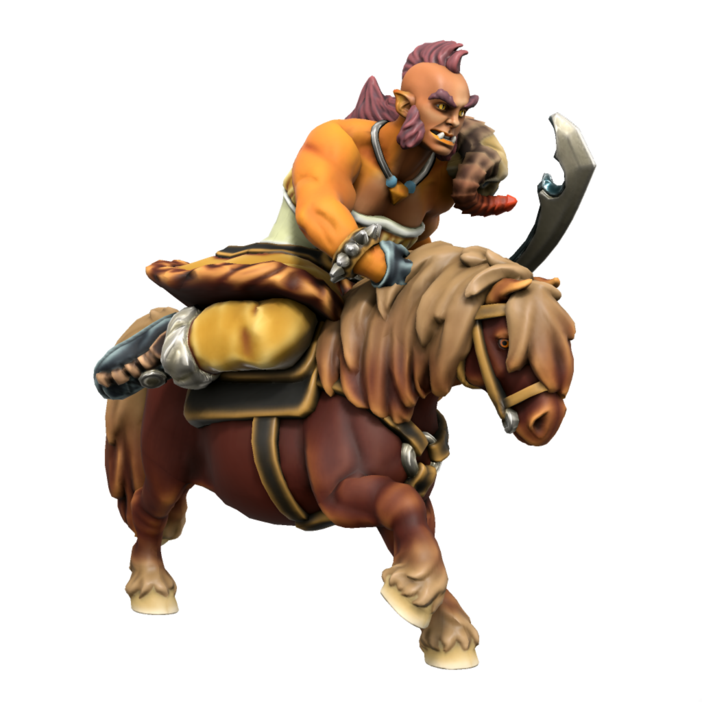

# Jotun
/jəʊtʌn/

The closest living relatives of the [Iotun](iotun) of old, the Jotun are by far the largest sapients on Iuncterra, standing between 8 and 10 feet tall. Generally preferring mountainous landscapes, Jotun tend to live in solitary homesteads or sometimes small villages. 

### Cultures

#### Veldspine Jotun

> **Languages** [Jotic](/languages/jotic), [Uttic](/languages/uttic), [Common](/languages/common)
> **Accent** [🗣️](https://www.dialectsarchive.com/finland-2)

Most Jotun in the world, which is only a few hundred, live in the Veldspine mountains. The Jotun of the mountains lead purely hunter gatherer lifestyle, subsisting predominantly on meat, nuts and berries. The main event in the Veldspine Jotun calendar is the dranamh, a tradition dating back to the Iotun age in which Jotun from across the mountains meet to roast and grind hazelnuts for flour, partaking in feasting and drinking long into the night. During this time, oathes are sworn, alliances forged, feuds settled - all in a single night, before returning to solitary lives in the mountains for another year.

#### Uthgardt Jotun

> **Languages** [Uttic](/languages/uttic), [Jotic](/languages/jotic), [Common](/languages/common)
> **Accent** [🗣️](https://www.dialectsarchive.com/iceland-2)

Some Jotun choose to come down from the mountains and live among the Uthgardt. They often do so for relgious reasons, having heard tell of the deeds of Uthgar and chosen to convert. Most choose to live among the more militaristic tribes, like the Grey Wolf and Red Tiger tribes.

#### Atkani Jotun

> **Languages** [Jotun-Atkani](/languages/atkani), [Atkani](/languages/atkani), [Jotic](/languages/jotic), [Common](/languages/common)
> **Accent** [🗣️](https://www.dialectsarchive.com/kazakhstan-2)

In times long forgotten, some Jotun travelled down from the mountains and somehow made it as far south as [Ordo'Atkan](/places/ordo_atkan). There their descendents live to this day, hunting and raising horses in the far northeast of the steppe, making their homes among the mountains there. Having been long separate from their northern kin, Atkani Jotun look noticeably different - while Jotun of the north tend to have blue, purple, grey or ashen white skin, Jotun of the south have bright orange, yellow and red skin and hair which extends far down their backs. Over the centuries, they have taken up pastoralist cultures and have selectively bread horses for size. Atkani Jotun horses can rival elk in size, and when ridden into battle they are a fearsome sight.

### Ageing
|/species/sapient/aging.xlsx:Jotun|