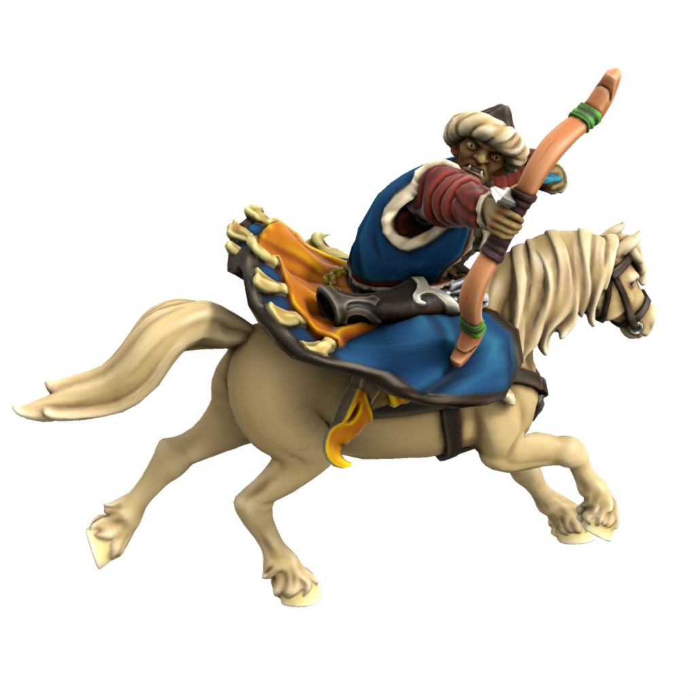
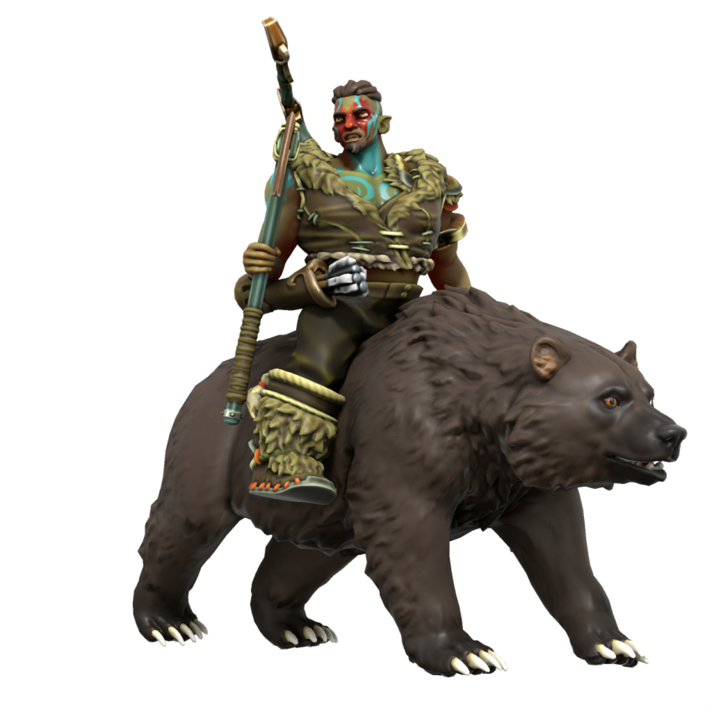

# Orc

Orc originate from the wide open planes of [Ordo'Atkan](/places/ordo-atkan), having adapted to first hunt and eventually ride horses. Even outside of their steppe homeland, horses and hunting hold a sacred significance in orcish culture. 

### Cultures

#### Atkani Orc
/ætkɑni/

> **Languages** [Atkani](/languages/atkani), [Common](/languages/common)
> **Accent** [🗣️](https://www.dialectsarchive.com/mongolia-1)

Orc of the Atkani steppe live a nomadic pastoral lifestyle, migrating every few weeks to move their herds on to greener pastures. All Atkani, from warlord to shepherd, are trained in the saddle and bow from birth. When the Great Khan issues a dudakh, *all* Atkani who are of sound body and fighting age answer the call, regardless of gender or profession.

The Atkani call their way of life "the way of the open sky", and to them the cultural traditions and nomadic lifestyle of their steppe are intimately tied with worship of [Ouron Teng](/cosmology/fey/major_fey/ouron.md), fey of the sky, whom they venerate above all others.

#### Uthgardt Orc
/ʊθɡɑdt/

> **Languages** [Uttic](/languages/uttic), [Common](/languages/common), [Noordic](/languages/noordic) (eastern tribes only)
> **Accent** [🗣️](https://www.dialectsarchive.com/iceland-2)

Many orc who leave Ordo'Atkan choose to settle in [Uttmark](/places/uttmark), finding the nomadic lifestyle of the Uthgardt familiar. Uthgardt orc live much as Uthgardt humans do, though some continue to worship Ouron Teng alongside [Uthgar](/cosmology/daemons/apotheotes/uthgar), and orc tend more towards archery and animal husbandry other Uthgardt.

### Ageing
|/species/sapient/aging.xlsx:Orc|